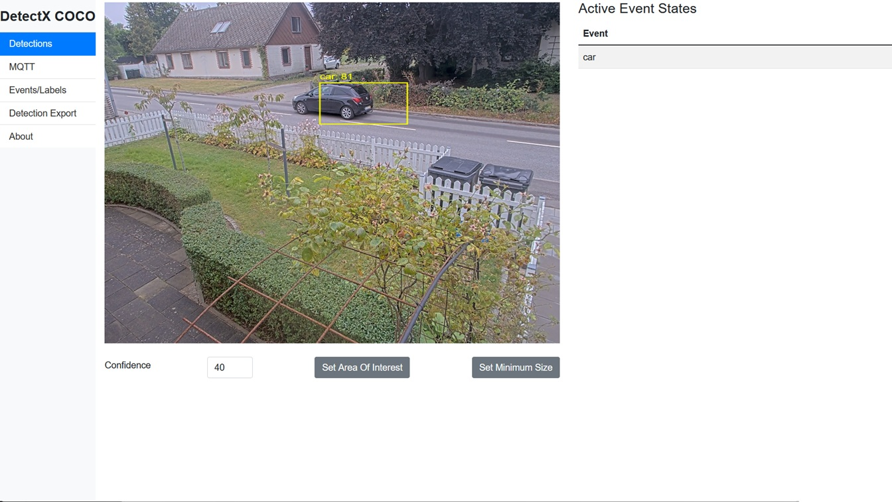
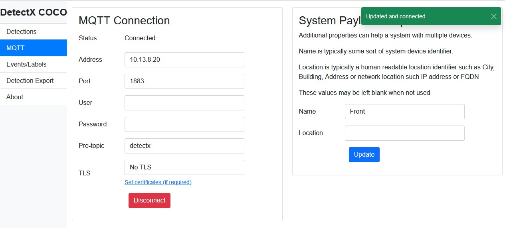
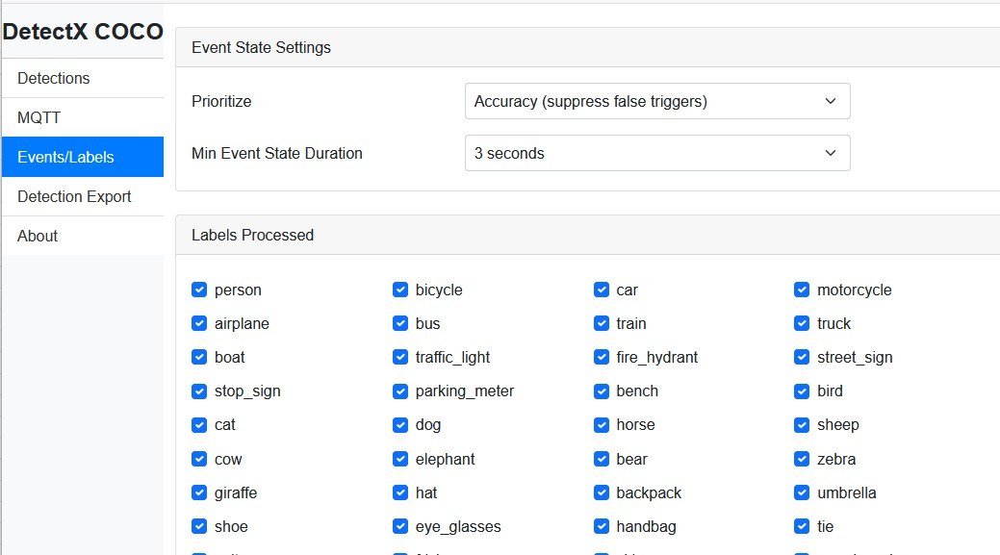
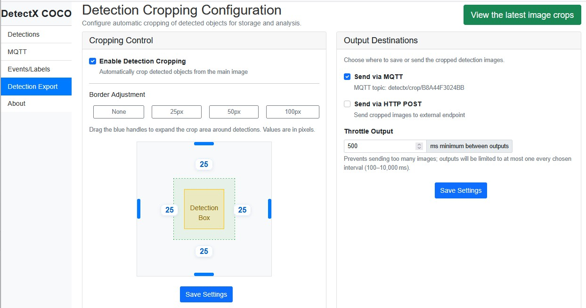
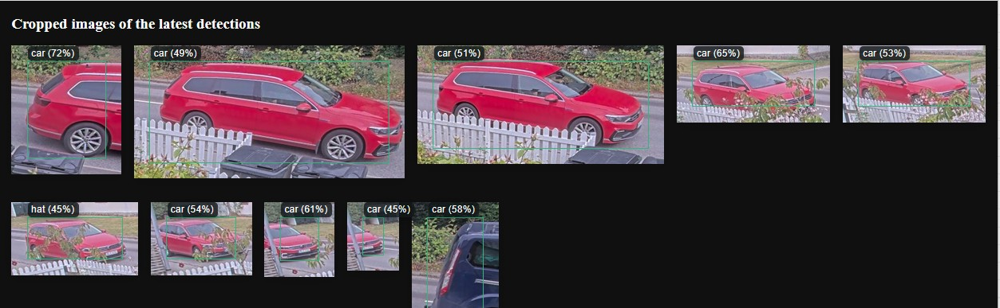
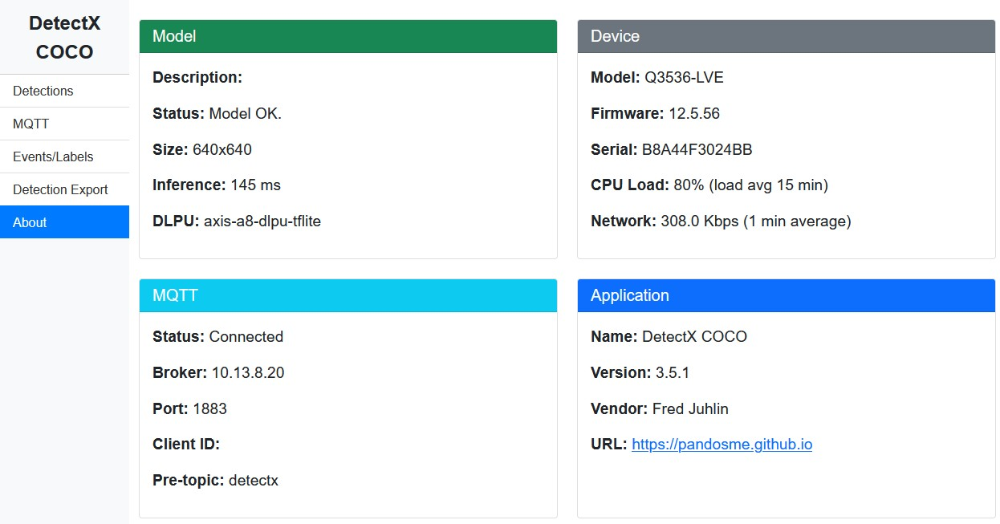

# DetectX

Run custom trained data models.  This package includes MobileNet SSD COCO model.  The idea is to replace this model with your own.
Please read [Train-Build.md](https://github.com/pandosme/DetectX/blob/main/docs/Train-Build.md) to understand how to train and build the package.

## Quick Start

### Building the Application

1. Clone the repository
2. Replace the model and labels (if using your own):
   - Place your TFLite model at `app/model/model.tflite`
   - Place your labels file at `app/model/labels.txt`
3. Run the build script:
   ```bash
   ./build.sh
   ```
4. Install the generated `.eap` file on your Axis camera

**Note:** As of version 4.0.0, the `prepare.py` script is no longer required. Model parameters are now automatically extracted during the build process.


***

# DetectX User & Integration Guide

***

## DetectX Model Overview

DetectX is a versatile ACAP (Axis Camera Application Platform) for on-camera, real-time object detection, supporting various detection tasks depending on the bundled model.  

Below are model-specific details relevant to the generic "COCO" demo:

| **Variant**    | **Dataset** | **Labels**                   | **ARTPEC-8** | **ARTPEC-9** |
|----------------|-------------|------------------------------|------------------------|--------------------------|
| DetectX COCO   | COCO        | person, bicycle, car, motorcycle, airplane, bus, train, truck, boat, traffic light, fire hydrant, stop sign, parking meter, bench, bird, cat, dog, horse, sheep, cow, elephant, bear, zebra, giraffe, backpack, umbrella, handbag, tie, suitcase, frisbee, skis, snowboard, sports ball, kite, baseball bat, baseball glove, skateboard, surfboard, tennis racket, bottle, wine glass, cup, fork, knife, spoon, bowl, banana, apple, sandwich, orange, broccoli, carrot, hot dog, pizza, donut, cake, chair, couch, potted plant, bed, dining table, toilet, TV, laptop, mouse, remote, keyboard, cell phone, microwave, oven, toaster, sink, refrigerator, book, clock, vase, scissors, teddy bear, hair drier, toothbrush | Model input: **640**<br>Model size: **Small** | Model input: **640**<br>Model size: **Small** |

*Note: ARTPEC-8 and ARTPEC-9 are Axis camera chipset platforms, with ARTPEC-9 offering enhanced performance and the ability to process larger images for improved detection quality.*

***

## Application Overview

DetectX provides real-time detection and state data from network cameras directly to your systems. **Intended for system integrators**, all outputs are designed for machine-to-machine (M2M) workflows, with flexible configuration from a built-in web UI and standards-based output via MQTT, ONVIF, or HTTP.

Typical use cases include:
- Vehicle and person detection in perimeter security
- Counting and presence analytics
- Intelligence enrichment for video management systems (VMS) or IoT platforms

***

## Menu & Feature Walkthrough

Each menu item below describes both *user options* and *integration outputs*, matched to the associated interface screenshot for easy visual orientation.

***

### 1. Detections

Allows you to see object detections overlayed on the video, and to adjust detection parameters.



- **Adjust Confidence Threshold:**  
  Set the minimum confidence (0–100) for labeling a detection as valid.
- **Set Area of Interest (AOI):**  
  Drag and resize a region to receive detections from only a selected area of the scene.
- **Configure Minimum Object Size:**  
  Exclude detections smaller than the specified pixel area.

**Visualization Notes:**
- The overlay updates approximately two times per second (“best effort”). The bounding boxes may lag or not exactly match all detections due to UI and network constraints.
- Use this page for *quick confirmation* that detection is working and properly tuned.

***

### 2. MQTT

Here you configure the gateway between the camera and your backend system.



- **Broker Address and Port:**  
  Specify the IP or hostname for your MQTT broker and port (default: 1883).
- **Authentication:**  
  Optional username and password if security is enforced.
- **Pre-topic:**  
  The prefix added to all MQTT topics (e.g., `detectx/detection/...`). Change if routing multiple cameras.
- **Additional Metadata:**  
  *Name* and *Location* properties help you distinguish events in multi-camera setups.

**Connection Status** is displayed, along with currently active parameters for fast troubleshooting.

***

### 3. Events/Labels

This section allows you to tailor detection and event signaling to your application:



- **Selectable Labels:**  
  Check or uncheck which object types (labels) are actively processed, reducing false positives or narrowing the scope (e.g., only cars and persons).
- **Event State Settings:**  
  - *Prioritize*: Opt for accuracy (suppresses false triggers) or responsiveness.
  - *Minimum Event State Duration*: Avoid chattering by forcing a minimum active/inactive state period for each label.

**Note:**  
Each label produces an independent event state. Tuning event parameters is crucial for noisy or high-traffic scenes.

***

### 4. Detection Export

When downstream systems require not only detection data but *cropped images* for each detection:



- **Enable/Disable Detection Cropping**
- **Set Border Adjustment:**  
  Expand or shrink the crop region around detected objects (e.g., add 25px margin).
- **Output Methods:**  
  - **MQTT:** Sends cropped images as base64 payloads.
  - **HTTP POST:** Posts the payload to a configurable endpoint.
- **Throttle Output:**  
  Limit image frequency to reduce load or network traffic.

#### View the Latest Crops

- Opens a gallery of up to 10 most recent image crops, labeled by type and confidence.
- Essential for quality assurance—check that crops are readable, in correct locations, and correspond to real detections.

***

### 5. About



A dashboard combining:
- **Model Status:** Input size, inference time, DLPU backend, and status.
- **Device Details:** Camera type, firmware, serial, CPU & network usage.
- **MQTT Status:** Broker and topic configuration, connection health.
- **Application Info:** Name, version, vendor, support/documentation link.

Use this page as your *first check* when troubleshooting or confirming installation.

***

## Integration & Payload Examples

DetectX delivers three primary payload types, all enrichable with the configured device name, location, and serial for easy association in your backend systems.

### 1. Detection (Bounding Box) on MQTT

**Topic:**  
`detectx/detection/<serial>`

**Example Payload:**
```json
{
  "detections": [
    {
      "label": "car",
      "c": 77,
      "x": 274,
      "y": 224,
      "w": 180,
      "h": 104,
      "timestamp": 1756453942980,
      "refId": 260
    }
  ],
  "name": "Front",
  "location": "",
  "serial": "B8A44F3024BB"
}
```

***

### 2. Event State on MQTT or ONVIF

**Topic:**  
`detectx/event/<serial>/<label>/<state>`

**Example Payload:**
```json
{
  "label": "car",
  "state": false,
  "timestamp": 1756453946184,
  "name": "Front",
  "location": "",
  "serial": "B8A44F3024BB"
}
```

***

### 3. Detection Crop Image

**MQTT/HTTP Topic or POST:**  
`detectx/crop/<serial>`

**Example Payload:**
```json
{
  "label": "truck",
  "timestamp": 1756454378759,
  "confidence": 47,
  "x": 25,
  "y": 25,
  "w": 218,
  "h": 106,
  "image": "/9j/4AAQSk...",  // JPEG in Base64
  "name": "Front",
  "location": "",
  "serial": "B8A44F3024BB"
}
```

***

## System Integrator Tips

- **Start with the About page** to confirm firmware, model, and MQTT status before field adjustments.
- Use Detection and Crops pages for rapid troubleshooting—verify detections visually before integrating triggers or actions.
- Use unique device names/locations in MQTT setup for scalable multi-camera deployments.
- Adjust event suppression and AOI settings based on site/scene context for best accuracy.

***

## Troubleshooting & Support

- If bounding boxes do not appear but the model status is OK, check confidence, AOI, and MQTT broker configuration.
- If crop images are misaligned or cut-off, adjust crop borders and AOI, validating via the “View the latest crops” gallery.
- Monitor CPU and network on the About page to avoid overload (especially on ARTPEC-8 devices).

***

## Version History

## 4.0.0	February 2, 2026

### Major Features
- **Pixel-Based Coordinate System**: Complete redesign from normalized [0-1000] coordinates to native pixel coordinates matching model input dimensions
- **1:1 Display Aspect Ratio**: All scale modes now display in model-sized 1:1 view (typically 640x640) for "what you see is what you get" visualization
- **Enhanced Scale Mode Support**: True visual representation for each mode:
  - **Center-Crop**: 640x640 1:1 video with no black bars
  - **Balanced**: 856x640 (4:3 aspect) squeezed into 1:1 display
  - **Letterbox**: 1136x640 (16:9 aspect) displayed in 1:1 with visible padding
- **Modern UI Redesign**: Complete redesign with top navigation bar replacing sidebar, modern card-based layouts, and improved visual hierarchy
- **Simplified Build Process**: Removed dependency on `prepare.py` - model parameters now automatically extracted during Docker build

### Coordinate System Changes
- **Pixel Coordinates Throughout**: All coordinates (detections, AOI, size filters) now use pixels relative to model input dimensions
- **MQTT Metadata**: Detection payloads now include `metadata` object with `modelWidth`, `modelHeight`, and `coordinateSystem: "pixels"` for client compatibility
- **Automatic Settings Migration**: Existing configurations automatically migrate from normalized to pixel coordinates via `coordinateVersion` flag
- **Direct Model-to-Display Mapping**: Simplified coordinate transformation eliminates multi-stage conversions and aspect ratio calculations

### Video Capture Optimization
- **Optimized Resolutions**: Balanced mode uses 856x640 (4:3) to maximize 640px height while maintaining divisibility by 8
- **Resolution Strategy**: Center-crop (640x640), Balanced (856x640), Letterbox (1136x640) - all optimized for model input size
- **Improved Memory Efficiency**: Direct pixel scaling reduces processing overhead

### UI Improvements
- **Custom AOI Overlay**: Removed jQuery imgAreaSelect plugin (944 lines), implemented lightweight custom overlay with mouse drag handlers
- **Canvas Alignment**: Perfect pixel-accurate alignment of detection overlays with video for all scale modes
- **Gradient Navigation Bar**: Improved contrast and readability with modern design
- **Responsive Design**: Optimized for mobile, tablet, and desktop viewing
- **Improved Form Controls**: Better focus states and validation feedback

### Technical Improvements
- **Direct Pixel Conversion**: Model outputs converted directly to pixels instead of intermediate [0-1000] normalization
- **Removed Display Space Transformations**: Eliminated videoAspect-based coordinate scaling simplifies codebase
- **Enhanced Crop Generation**: Crops use pixel-based scaling from model space to video frame space
- **Settings Migration**: Automatic one-time migration from coordinateVersion 1 to 2
- **Improved MQTT Payload Handling**: Better error messages for oversized crops

### Bug Fixes
- Fixed coordinate misalignment in all scale modes with pixel-accurate canvas positioning
- Resolved letterbox mode canvas stretching by using calculated pixel dimensions
- Fixed canvas clearing to use actual dimensions instead of hardcoded values
- Improved video and overlay synchronization with object-fit strategies

### Breaking Changes
- **MQTT Output Format**: Coordinates now in pixels with metadata (breaking for API consumers)
- **Coordinate System**: Changed from normalized [0-1000] to pixels (coordinateVersion: 2)
- **Display Aspect**: Changed from 16:9 to 1:1 aspect ratio for all visualizations
- **Settings Format**: AOI and size filters now use pixel coordinates (automatic migration on first startup)
- **API Clients**: MQTT consumers need to detect `metadata.coordinateSystem === "pixels"` and scale accordingly

### Documentation
- Updated `CLAUDE.md` with coordinate system architecture
- Added comprehensive implementation plan documentation
- Updated README with simplified build instructions

## 3.5.3	Nov 29, 2025
- Fixed a memory leak

## 3.5.2       Aug 29, 2025
- Fixed "black-box-video" shown on selected cameras

### 3.5.1	Aug 29, 2025
- Added Detection Export
- Updated GUI
- MQTT improvements


### 3.4.0	May 14, 2025
- MQTT Cleanup
- GUI fixes
- Fixed IP address in MQTT connect message.

### 3.3.10	March 04, 2025
- MQTT Refactoring

### 3.3.8	February 27, 2025
- Fixed a flaw in html that crashed the detections page
  (stupid bug introduced in previous version)
- Fixed MQTT stability (recurring disconnects)
- Added MQTT connect message and more properties in LWT

### 3.3.7	February 22, 2025
- Fixed MQTT stability (recurring disconnects)
- Improved behaviour in GUI
	* Display error when not running on ARTPEC-8 (e.g. Ambarella CV25)
	* Display info when model is loading
	* Display info when application not responding

### 3.3.6	February 7. 2025
- Fixed a bug that could crash the application if the user interface is active for a longer period of time.  
  (Credit to Fredrik Lax, Sundsvall-IT who found it)

### 3.3.5	February 6, 2025
- Fixed a serious memory leak

### 3.3.5	December 22, 2024
- Restructured and added more information on the About page

### 3.3.0	December 21, 2024
- Added support for MQTT

### 3.2.0	December 20, 2024
- Bumbed ACAP wrapper up to 3.2.0

### 3.1.5	December 11, 2024
- Fixed a flaw that impact events.

### 3.1.0	November 27, 2024
- Switched to latest ACAP SDK.  Please remove previous version if they are below 3.0.0.
  * Refactoring on various files
- Modified events to give all labels its own event
- Updated visualization in user interface

### 2.2.0	October 19, 2024
- Added event "Label Counter" for use cases needing to know how many objects are detected
- Fixed flaw for Detection transition

### 2.1.1	October 13, 2024
- Fixed flawed event states
- Fixed potential memoryleak

### 2.1.0 October 11, 2024
- Added support for Detection transition
- Removed ability to store detectection images on SD Card

### 1.2.0	October 7, 2024
- Added support fo filter minimum size
- Fixed a flaw that preventet detecting mutliple detections in the same scene.

### 1.0.3	September 15, 2024
- Restructures the model.json and settings.json and code realted to those config files including prepare.py

### 1.0.2	September 7, 2024
- Fixed flaw that prevented detections
- Fixed flaw that did not store images on SD Card when users enabled this feature

### 1.0.1	Septeber 6, 2024
- Restructured SD Card image store on detect images. Fix a flaw that could result in error "Too many files open...".
- Fixed so Reset button cleared all bounding boxes and table

### 1.0.0	September 5, 2024
- Initial commit


