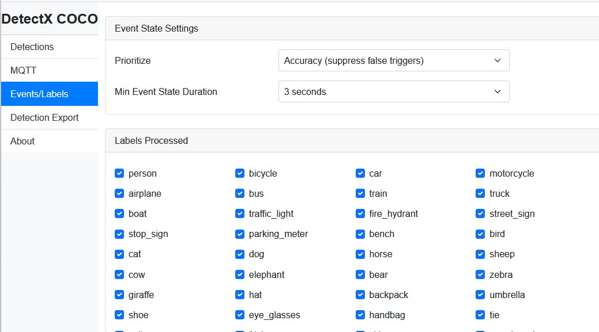
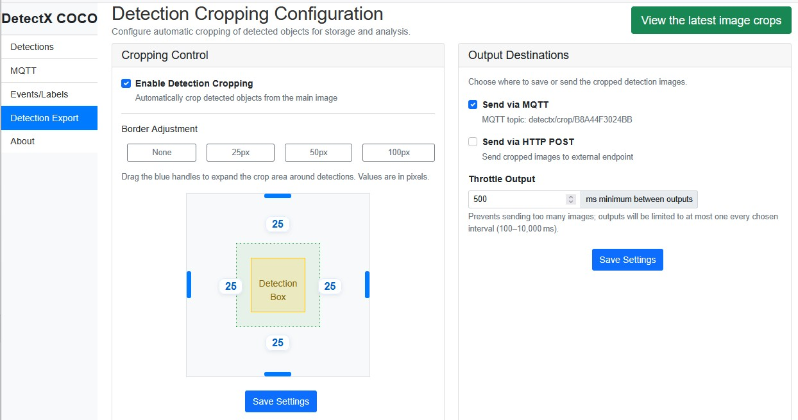
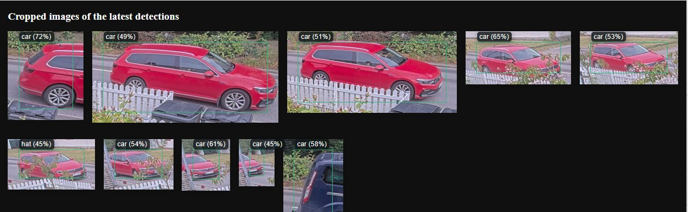
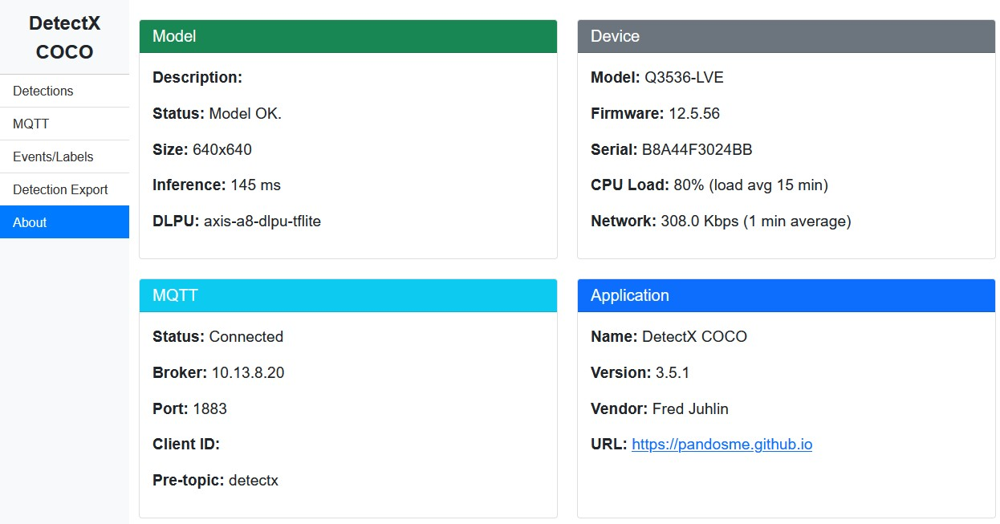

# DetectX

Run custom-trained **YOLOv8** object-detection models directly on Axis cameras with
ARTPEC-8 or ARTPEC-9 chipsets. Detections are published over MQTT, ONVIF events and
HTTP for machine-to-machine use. The package ships a YOLOv8n COCO model at **640x384**
as a working default; the intent is that you replace it with your own model.

DetectX is a **base to build on**: the application introspects whatever model you give
it -- input resolution, class count, quantization -- so you change behaviour by changing
the model, not the code. See [Train-Build.md](Train-Build.md) to train and
export your own.

## Acknowledgements

Thanks to [Pavel Kotyza](https://github.com/kotyzap) for his work enabling
YOLOv8 models on Axis cameras through
[YOLOv8-on-AXIS-ACAP](https://github.com/kotyzap/YOLOv8-on-AXIS-ACAP).

> **DetectX 5.x runs YOLOv8. It does not run YOLOv5.** The output layout is different
> (anchor-free, two tensors, no objectness), so a 4.x model will not load here. The
> YOLOv5 line is frozen at 4.1.1 and is no longer maintained.
>
> **ARTPEC-9 requires Axis OS 13 or later.** Earlier firmware miscomputes YOLOv8 on the
> A9 DLPU -- the model loads and runs at full speed but returns high-confidence garbage,
> while the same package is correct on ARTPEC-8.

## Quick Start

### Downloading a Pre-Compiled Package

Pre-compiled `.eap` packages are published by GitHub Actions. Download the latest pre-compiled package here:

Two packages are published, one per chipset -- they are **not** interchangeable:

| Package | Chip |
|---|---|
| `DetectX_<version>_artpec8.eap` | ARTPEC-8 |
| `DetectX_<version>_artpec9.eap` | ARTPEC-9 |

Open the repository's **Releases** page and download the one matching your camera's
chipset. ARTPEC-8 is quantized per-tensor; ARTPEC-9 per-channel. Installing the wrong
one gives wrong detections.

> **Axis OS 13 development installs:** To run an unsigned ACAP, first install the
> [Dev-Mode ACAP](https://www.axis.com/es-es/for-developers/news/acap-developer-mode).
> Downloading it requires signing in with a MyAxis account.

### Building the Application

```bash
./build.sh                 # builds both ARTPEC-8 and ARTPEC-9 packages
./build.sh --target a8     # one chip only
```

To use your own model, export it per chip and drop the files in before building:

```bash
./export_yolov8.py --target a8 --weights your.pt --width 640 --height 384 \
    --calibration-dir /path/to/calibration/images --output app/model/model-a8.tflite
./export_yolov8.py --target a9 --weights your.pt --width 640 --height 384 \
    --calibration-dir /path/to/calibration/images --output app/model/model-a9.tflite
cp your-labels.txt app/model/labels.txt
./build.sh
```

Model parameters -- input size, tensor shapes, quantization scales -- are extracted
from the TFLite files automatically at build time; nothing needs editing by hand.


***

# DetectX User & Integration Guide

***

## DetectX Model Overview

DetectX is a versatile ACAP (Axis Camera Application Platform) for on-camera, real-time object detection, supporting various detection tasks depending on the bundled model.  

DetectX 5.x is **single-stage (1-tier) detection**: one YOLOv8 model per frame
produces boxes and class labels directly.

Below are model-specific details relevant to the generic "COCO" demo:

| **Variant**    | **Dataset** | **Labels**                   | **ARTPEC-8** | **ARTPEC-9** |
|----------------|-------------|------------------------------|------------------------|--------------------------|
| DetectX COCO   | COCO        | person, bicycle, car, motorcycle, airplane, bus, train, truck, boat, traffic light, fire hydrant, stop sign, parking meter, bench, bird, cat, dog, horse, sheep, cow, elephant, bear, zebra, giraffe, backpack, umbrella, handbag, tie, suitcase, frisbee, skis, snowboard, sports ball, kite, baseball bat, baseball glove, skateboard, surfboard, tennis racket, bottle, wine glass, cup, fork, knife, spoon, bowl, banana, apple, sandwich, orange, broccoli, carrot, hot dog, pizza, donut, cake, chair, couch, potted plant, bed, dining table, toilet, TV, laptop, mouse, remote, keyboard, cell phone, microwave, oven, toaster, sink, refrigerator, book, clock, vase, scissors, teddy bear, hair drier, toothbrush | YOLOv8n @ **640x384**<br>~50  ms / 20 fps | YOLOv8n @ **640x384**<br>(measured on OS 13) |

*Note: ARTPEC-8 and ARTPEC-9 are Axis camera chipset platforms, with ARTPEC-9 offering enhanced performance and the ability to process larger images for improved detection quality.*

The default input is **640x384** -- a 16:9 shape, not square. A square input on a 16:9
scene wastes about 44% of its pixels on padding. 640x384 runs at ~20 fps on ARTPEC-8 and
covers the full scene; it is a deliberately fast, general-purpose starting point. When to
raise it, and what it costs, is covered in **Choosing a configuration** below. Both
dimensions must be multiples of 32.

***

## Choosing a configuration: speed, quality and distance

Detection is governed by three levers, and they trade against each other. There is no
single best setting -- the right one depends on how far away your objects are and how
fast you need answers.

1. **Input resolution** -- the single biggest lever. It sets both latency and how far
   away an object can still be detected. Baked into the model at export time.
2. **Model size** (n / s / m) -- more capacity means better accuracy on hard or small
   objects, at a proportional cost in latency.
3. **Class count** -- every class you keep costs post-processing on every frame. A model
   trained on the 10 classes you care about is meaningfully faster than the 80-class COCO
   demo at the same resolution.

### Measured performance -- ARTPEC-8, 80-class COCO

End-to-end time (capture + preprocessing + inference + NMS), measured on a Q3536-LVE.
This is what frame rate actually depends on.

**YOLOv8n (nano)** -- the ARTPEC-8 workhorse:

| Input | fps | latency | relative range |
|---|---|---|---|
| 416x256 | **43** | 23 ms | 0.7x |
| **640x384** (default) | **20** | 50 ms | 1.0x |
| 800x480 | 11 | 88 ms | 1.2x |
| 960x544 | 9 | 106 ms | 1.4x |
| 1280x736 | 5 | 200 ms | 1.9x |

**YOLOv8s (small)** -- better accuracy, roughly 1.6x the latency of nano:

| Input | fps | latency | relative range |
|---|---|---|---|
| 416x256 | 27 | 37 ms | 0.7x |
| 640x384 | 12 | 81 ms | 1.0x |
| 800x480 | 7 | 140 ms | 1.2x |
| 960x544 | 6 | 172 ms | 1.4x |
| 1280x736 | 3 | 315 ms | 1.9x |

Latency scales **linearly with input pixels** and detection range scales with their
**square root**: `latency (ms) ~ 213 x megapixels` for nano, `~ 334 x megapixels` for
small. So four times the pixels buys twice the distance at four times the cost. You can
read any point off these fits without measuring -- pick a latency budget, divide, and
that is your pixel budget.

Medium (yolov8m) is not recommended on ARTPEC-8 -- even 640x384 exceeds 300 ms. It is an
ARTPEC-9 option.

### Recommendations

| Your priority | Configuration |
|---|---|
| **Speed** -- counting, presence, busy scenes | nano @ 416x256 or 640x384. 20-43 fps, ample headroom. |
| **Balance** -- general perimeter / person & vehicle | **nano @ 640x384 (the default).** 20 fps, full field of view. |
| **Distance** -- objects far from the camera | Raise resolution before model size. nano @ 960x544 or 1280x736 reaches ~1.4-1.9x the range at 9 / 5 fps. A narrower lens is also worth more than a bigger model -- it puts more pixels on a distant object for free. |
| **Quality** -- small or visually similar objects up close | Step up to small at the same resolution before raising resolution further. |
| **Any of the above** | **Cut the class list.** The tables are 80-class COCO; a 10-class model shifts every number down. Train on only what you act on. |

**Why resolution beats model size for distance.** Detection range is set by how many
pixels an object occupies at the network input, not by model capacity. A larger model
cannot detect what the input resolution has already thrown away. At equal latency, a
smaller model at higher resolution reaches further than a larger model at lower
resolution. Reach for a bigger model when objects are *close but hard* (small, occluded,
visually similar); reach for more pixels when objects are *far*.

**Measure on your own hardware.** ARTPEC-9 is faster than ARTPEC-8 and these numbers
will differ. Two scripts reproduce the tables:
- `benchmark_resolutions.sh` -- uploads models through the app's own HTTP endpoint and
  reads the reported end-to-end time. Needs only the camera web login. **These are the
  real-world numbers above.**
- `benchmark_larod.sh` -- times raw DLPU inference via `larod-client` over SSH, the way
  [axis-model-zoo](https://github.com/AxisCommunications/axis-model-zoo) does. Faster to
  run and good for *comparing* models, but it carries a fixed per-run overhead that a
  running ACAP amortizes, so its absolute numbers are pessimistic below ~1 megapixel. Use
  it for relative comparison, not for predicting frame rate.

***

## Application Overview

DetectX provides real-time detection and state data from network cameras directly to your systems. **Intended for system integrators**, all outputs are designed for machine-to-machine (M2M) workflows, with flexible configuration from a built-in web UI and standards-based output via MQTT, ONVIF, or HTTP.

Typical use cases include:
- Vehicle and person detection in perimeter security
- Counting and presence analytics
- Intelligence enrichment for video management systems (VMS) or IoT platforms

***

## Menu & Feature Walkthrough

Each menu item below describes both *user options* and *integration outputs*, matched to the associated interface screenshot for easy visual orientation.

***

### 1. Detections

Allows you to see object detections overlayed on the video, and to adjust detection parameters.


- **Adjust Confidence Threshold:**  
  Set the minimum confidence (0–100) for labeling a detection as valid.
- **Set Area of Interest (AOI):**  
  Draw a **polygon** to receive detections only from the area inside the polygon. Click to add vertices; drag vertices to reshape.
- **Add Exclude Zones:**  
  Draw one or more **exclude polygons** to suppress detections in specific areas (e.g. tree, reflection, road sign). Multiple zones are supported.
- **Configure Minimum Object Size:**  
  Exclude detections smaller than the specified pixel area.

**Visualization Notes:**
- The overlay updates approximately two times per second (“best effort”). The bounding boxes may lag or not exactly match all detections due to UI and network constraints.
- Use this page for *quick confirmation* that detection is working and properly tuned.

***

### 2. MQTT

Here you configure the gateway between the camera and your backend system.


- **Broker Address and Port:**  
  Specify the IP or hostname for your MQTT broker and port (default: 1883).
- **Authentication:**  
  Optional username and password if security is enforced.
- **Pre-topic:**  
  The prefix added to all MQTT topics (e.g., `detectx/detection/...`). Change if routing multiple cameras.
- **Additional Metadata:**  
  *Name* and *Location* properties help you distinguish events in multi-camera setups.

**Connection Status** is displayed, along with currently active parameters for fast troubleshooting.

***

### 3. Events/Labels

This section allows you to tailor detection and event signaling to your application:



- **Selectable Labels:**  
  Check or uncheck which object types (labels) are actively processed, reducing false positives or narrowing the scope (e.g., only cars and persons).
- **Event State Settings:**  
  - *Prioritize*: Opt for accuracy (suppresses false triggers) or responsiveness.
  - *Minimum Event State Duration*: Avoid chattering by forcing a minimum active/inactive state period for each label.
- **SD Card Training Capture:**  
  When enabled, full-frame JPEG images and matching YOLO-format label files are saved to the SD card whenever a detection event is active. Images are captured at a configurable interval (1–60 s); the first image is captured immediately on the event going active. A **Download Archive** button packages all captured images and labels into a zip file ready for import into your training pipeline. A **Clear All** button removes all stored files. Capture stops automatically at 2 000 images to protect SD card space.

**Note:**  
Each label produces an independent event state. Tuning event parameters is crucial for noisy or high-traffic scenes.

***

### 4. Detection Export

When downstream systems require not only detection data but *cropped images* for each detection:



- **Enable/Disable Detection Cropping**
- **Set Border Adjustment:**  
  Expand or shrink the crop region around detected objects (e.g., add 25px margin). Presets available for common use cases.
- **Output Methods:**  
  - **MQTT:** Sends cropped images as base64 payloads.
  - **HTTP POST:** Posts the payload to a configurable endpoint.
- **Throttle Output:**  
  Limit image frequency to reduce load or network traffic.

#### View the Latest Crops

- Opens a gallery of up to 10 most recent image crops, labeled by type and confidence.
- Essential for quality assurance—check that crops are readable, in correct locations, and correspond to real detections.

***

### 5. About



A dashboard combining:
- **Model Status:** Input size, inference time, DLPU backend, and status.
- **Device Details:** Camera type, firmware, serial, CPU & network usage.
- **MQTT Status:** Broker and topic configuration, connection health.
- **Application Info:** Name, version, vendor, support/documentation link.

Use this page as your *first check* when troubleshooting or confirming installation.

***

## Integration & Payload Examples

DetectX delivers three primary payload types, all enrichable with the configured device name, location, and serial for easy association in your backend systems.

### 1. Detection (Bounding Box) on MQTT

**Topic:**  
`detectx/detection/<serial>`

**Example Payload:**
```json
{
  "detections": [
    {
      "label": "car",
      "c": 77,
      "x": 274,
      "y": 224,
      "w": 180,
      "h": 104,
      "timestamp": 1756453942980,
      "refId": 260
    }
  ],
  "name": "Front",
  "location": "",
  "serial": "B8A44F3024BB"
}
```

***

### 2. Event State on MQTT or ONVIF

**Topic:**  
`detectx/event/<serial>/<label>/<state>`

**Example Payload:**
```json
{
  "label": "car",
  "state": false,
  "timestamp": 1756453946184,
  "name": "Front",
  "location": "",
  "serial": "B8A44F3024BB"
}
```

***

### 3. Detection Crop Image

**MQTT/HTTP Topic or POST:**  
`detectx/crop/<serial>`

**Example Payload:**
```json
{
  "label": "truck",
  "timestamp": 1756454378759,
  "confidence": 47,
  "x": 25,
  "y": 25,
  "w": 218,
  "h": 106,
  "image": "/9j/4AAQSk...",  // JPEG in Base64
  "name": "Front",
  "location": "",
  "serial": "B8A44F3024BB"
}
```

***

## System Integrator Tips

- **Start with the About page** to confirm firmware, model, and MQTT status before field adjustments.
- Use Detection and Crops pages for rapid troubleshooting—verify detections visually before integrating triggers or actions.
- Use unique device names/locations in MQTT setup for scalable multi-camera deployments.
- Adjust event suppression and AOI settings based on site/scene context for best accuracy.

***

## Troubleshooting & Support

- If bounding boxes do not appear but the model status is OK, check confidence, AOI, and MQTT broker configuration.
- If crop images are misaligned or cut-off, adjust crop borders and AOI, validating via the “View the latest crops” gallery.
- Monitor CPU and network on the About page to avoid overload (especially on ARTPEC-8 devices).

***

## Version History

## 5.0.0

First YOLOv8 release. The YOLOv5 line (4.x) is frozen at 4.1.1 and no longer maintained.

### Breaking changes
- **YOLOv8 replaces YOLOv5.** Anchor-free head with two output tensors
  (`[1,4,N]` coordinates and `[1,classes,N]` scores) instead of one fused
  `[1,N,5+classes]`, and no objectness column. 4.x models will not load on 5.x.
- **Separate ARTPEC-8 and ARTPEC-9 packages.** The A8 DLPU requires per-tensor
  weight quantization, the A9 uses per-channel; the two are not interchangeable.
  Previously a single package served both.
- Models must be exported with `export_yolov8.py`, which produces uint8 I/O and the
  split coordinate/score tensors the runtime needs. Ultralytics' built-in TFLite
  export (float32 I/O, one fused tensor) cannot be decoded by this application.

### New
- Default model is **YOLOv8n COCO at 640x384** -- fast (~20 fps on ARTPEC-8) and
  16:9 to match the scene. See **Choosing a configuration** for when to change it.
- Built against the current Axis ACAP SDK (manifest schema 2.2.0), DLPU declared as
  a required resource, `runMode: respawn`.
- The application introspects the model at startup (input size, class count,
  quantization), so any exported model drops in without code changes.
- `export_resolutions.sh` / `benchmark_resolutions.sh` / `benchmark_larod.sh` for
  exporting a model across resolutions and measuring latency on your own camera.
- Model load is deferred past application start so the web UI stays responsive and
  reports "Loading model" during the 30-60 s cold start instead of appearing hung.
- PyTorch checkpoints for the shipped models are in `models/`.

### Fixes
- Corrected a double-free in larod teardown that aborted the process on every stop.

### Requirements
- **ARTPEC-9 requires Axis OS 13 or later.**

---

## Legacy YOLOv5 Releases

DetectX 5.x does not support YOLOv5 models. For an existing YOLOv5 deployment or
further work on that model format, use the frozen legacy line instead:

- **Latest legacy release:** [v4.1.1](https://github.com/pandosme/DetectX/tree/v4.1.1)
- **Legacy development branch:** [4.1.0](https://github.com/pandosme/DetectX/tree/4.1.0)

```bash
git checkout v4.1.1  # last YOLOv5 release
# or
git checkout 4.1.0   # legacy development branch
```

The 4.x line is not compatible with v5 models or packages, and receives no new
features.

## 4.1.1

- Fixed EAP release-asset publishing.

## 4.1.0

- Added polygon AOI and exclusion zones, runtime model upload, SD-card training
  capture, and bounding-box overlay fixes.

## 4.0.0 - February 2, 2026

- Moved from normalized coordinates to model-input pixel coordinates.
- Added automatic migration for existing AOI and size-filter settings.
- Redesigned the web UI with top navigation and card-based layouts.
- Removed the old `prepare.py` dependency; model parameters were extracted during
  the Docker build.

## 3.5.3 - November 29, 2025

- Fixed a memory leak.

## 3.5.2 - August 29, 2025

- Fixed black-box video on selected cameras.

## 3.5.1 - August 29, 2025

- Added Detection Export, GUI updates, and MQTT improvements.

## 3.4.0 - May 14, 2025

- Cleaned up MQTT handling and fixed GUI and MQTT connection issues.

## 3.3.10 - March 4, 2025

- Refactored MQTT support.

## 3.3.8 - February 27, 2025

- Fixed a detection-page crash and MQTT stability issues.
- Added MQTT connect messages and more last-will properties.

## 3.3.7 - February 22, 2025

- Improved MQTT stability and UI feedback for unsupported platforms, model
  loading, and unavailable applications.

## 3.3.6 - February 7, 2025

- Fixed a UI-related crash during extended use.

## 3.3.5 - February 2025

- Fixed a serious memory leak and expanded About-page information.

## 3.3.0 - December 21, 2024

- Added MQTT support.

## 3.2.0 - December 20, 2024

- Updated the ACAP wrapper to 3.2.0.

## 3.1.5 - December 11, 2024

- Fixed event handling.

## 3.1.0 - November 27, 2024

- Updated the ACAP SDK, refactored application files, and added per-label
  events and visualization improvements.

## 2.2.0 - October 19, 2024

- Added the Label Counter event and fixed detection transitions.

## 2.1.1 - October 13, 2024

- Fixed event states and a potential memory leak.

## 2.1.0 - October 11, 2024

- Added detection transitions and removed SD-card detection-image storage.

## 1.2.0 - October 7, 2024

- Added minimum-size filtering and fixed multiple detections in one scene.

## 1.0.3 - September 15, 2024

- Restructured model and settings configuration.

## 1.0.2 - September 7, 2024

- Fixed detection and SD-card image-storage issues.

## 1.0.1 - September 6, 2024

- Restructured SD-card detection-image storage and fixed reset behavior.

## 1.0.0 - September 5, 2024

- Initial release.
